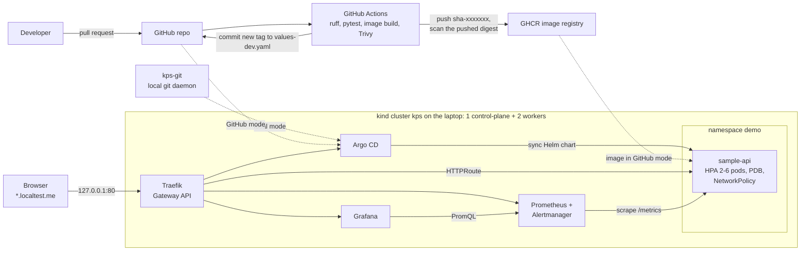

# kubernetes-platform-starter

[](https://github.com/Sameerkhan8/kubernetes-platform-starter/actions/workflows/ci.yml)
[](https://github.com/Sameerkhan8/kubernetes-platform-starter/actions/workflows/helm.yml)
[](https://github.com/Sameerkhan8/kubernetes-platform-starter/actions/workflows/terraform.yml)

A small but complete Kubernetes platform that runs on a laptop for free.
One command (`make up`) creates a 3-node [kind](https://kind.sigs.k8s.io/) cluster and installs
a Gateway API edge (Traefik), monitoring (Prometheus, Alertmanager, Grafana), GitOps (Argo CD)
and a sample Python service with autoscaling, zero-downtime rollouts and 10 alerts with runbooks.
The same service has a CI pipeline for GitHub Actions and a Terraform module for a private GKE
cluster on Google Cloud.

**What this project shows I can set up for your team:**

- **Deploys that drop no requests.** A test restarts every pod under steady traffic: 0 failed
  requests in every run. A control run with the drain settings switched off lost requests,
  so the settings are proven to matter.
- **Autoscaling that pays for itself.** Pods scale from 2 to 6 under CPU load in about a minute,
  and back down on their own once the load is gone.
- **Alerts someone can act on.** 10 custom alerts, each unit-tested and linked to a runbook
  that says what to check and how to fix it. 8 of them were triggered on the live cluster.
- **A way off ingress-nginx.** The ingress-nginx project is archived. This uses the Gateway API,
  the upstream successor that GKE also supports.
- **Keyless, least-privilege cloud access.** GitHub Actions logs in to Google Cloud with OIDC
  (no JSON keys), and the Terraform module builds a private GKE cluster.
- **Locked down by default.** Default-deny network policies (in and out), Pod Security
  "restricted", non-root read-only containers, and scripts that can never touch the wrong cluster.

Every claim below comes with a command you can run, and the numbers are from real runs.

Built by **Sameer Pathan**, DevOps engineer ([GitHub @Sameerkhan8](https://github.com/Sameerkhan8)).
Questions, or want a setup like this for your team? Open an issue or contact me through my profile.
<!-- Add your Upwork profile link on the line above. -->

## Try it in 3 commands

You need Docker, kind, kubectl, Helm and make ([Prerequisites](#prerequisites)).

```bash
make doctor   # check tools, free ports and memory (touches no cluster)
make up       # create the cluster and install everything (about 4-5 minutes once images are cached)
make smoke    # call every URL through the gateway: PASS/FAIL per check
```

Then open http://app.localtest.me, or follow the [demos](#demos). `make down` removes it all.

## Contents

- [Architecture](#architecture)
- [Features](#features)
- [Prerequisites](#prerequisites)
- [Quickstart](#quickstart)
- [Demos](#demos)
- [Measured results](#measured-results)
- [Design decisions](#design-decisions)
- [What I would add in production](#what-i-would-add-in-production)
- [Repository layout](#repository-layout)
- [Cleanup](#cleanup)
- [Troubleshooting](#troubleshooting)
- [License](#license)

## Architecture



- **Traffic:** browser to `127.0.0.1:80`, into the kind control-plane container, to Traefik
  (hostPort), then an `HTTPRoute` sends it to a ready app pod.
- **Deploys:** Argo CD pulls the Helm chart from Git and applies it. Locally it reads this repo
  from a small git daemon container, so GitOps works before anything is pushed. After the repo
  is pushed, the same app can point at GitHub, and CI only changes an image tag in Git.
- **Monitoring:** Prometheus scrapes the app, Kubernetes and the platform components. Alerts go to
  Alertmanager, and Grafana shows a "golden signals" dashboard that ships with the app chart.

More detail, including the deploy and monitoring flows and the security controls:
[docs/architecture.md](docs/architecture.md).

## Features

| Area | What is in the repo | Status |
|---|---|---|
| Local cluster | kind with 1 control-plane and 2 workers in two simulated zones (node labels), Kubernetes 1.36.4, one-command setup | Works locally, tested |
| Edge / traffic | Gateway API with Traefik, 5 host names on `127.0.0.1`. The chart also has an optional `Ingress` | Works locally, tested (`make smoke`) |
| Sample service | FastAPI app: health and readiness probes, Prometheus metrics, graceful drain on SIGTERM. Demo-only endpoints (CPU burn, error injection, API docs) that the production profile switches off | Works locally, 68 unit tests |
| Helm chart | Hardened Deployment, HPA, PDB, topology spread, NetworkPolicies (default-deny in and out), HTTPRoute, ServiceMonitor, PrometheusRule, dashboard. Values for dev, prod and local | Works locally, tested. `helm lint --strict` and kubeconform clean |
| Autoscaling | CPU-based HPA with scale-up and scale-down behavior | Tested (`make load`: 2 to 6 pods and back) |
| Zero-downtime rollouts | preStop sleep, readiness flip on SIGTERM, graceful drain, `maxUnavailable: 0` | Tested (`make rollout-test`: 0 failed requests) |
| Monitoring and alerting | kube-prometheus-stack, a Grafana dashboard, 10 custom alerts, 10 runbooks, promtool unit tests, Alertmanager inhibit rules so one problem notifies once | All 10 alerts unit-tested with promtool. 8 of the 10 were also triggered for real on the kind cluster (see the [runbook index](docs/runbooks/README.md)) |
| Security policies | Default-deny ingress and egress in the app namespace, Pod Security "restricted" | Tested (`make policy-test`: 4 checks with throwaway pods) |
| GitOps | Argo CD, auto-sync with prune and self-heal. Local git daemon or GitHub as the source | Local mode tested. GitHub mode needs the repo to be pushed |
| CI/CD | GitHub Actions: lint, tests, image build, Trivy scan, push to GHCR, Trivy scan of the pushed digest, GitOps tag bump, release tags from `v*` git tags. Separate Helm and Terraform workflows | actionlint and zizmor clean. Runs after the repo is pushed (not run on GitHub yet) |
| Cloud infrastructure | Terraform for a private GKE cluster, VPC with flow logs, Cloud NAT, Artifact Registry and GitHub OIDC login (no JSON keys) | Validated (fmt/validate/tflint) + offline unit tests with a mocked provider. Not applied |
| Supply chain | Actions pinned by commit SHA, Dependabot, pinned base image digest and Python dependencies, checksums for every downloaded tool, SBOM and provenance on push | Trivy run locally: 0 fixable HIGH/CRITICAL findings. SBOM and provenance run in CI after push |
| Laptop safety | Repo-local kubeconfig and a context guard on every cluster command | Tested (aborts on a wrong context, a non-kind API server, or Helm variables that would redirect it) |

## Prerequisites

| Tool | Tested with | Notes |
|---|---|---|
| Docker | 29.1.3 | The only runtime you need. Tests and most lint tools run in containers if they are not installed |
| kind | v0.33.0 | |
| kubectl | v1.36.2 | |
| Helm | v3.21.2 and v4.3.0 | 3.18 or newer |
| make, git, curl | | |

- **Memory:** have about 6 GB of RAM free. The whole cluster measured about 3.7 GiB
  (see [Measured results](#measured-results)).
- **Ports:** 80 on `127.0.0.1` (and 443, which is mapped but not used yet; if 443 is busy,
  `make up` uses 8443 instead). If 80 is busy, see [Troubleshooting](#troubleshooting).
- **Linux inotify limits:** multi-node kind clusters can fail with "too many open files" when
  `fs.inotify.max_user_instances` is low. `make doctor` checks it and prints the fix.
  `make up` and every `make` demo worked with the default of 128. The manual node-failure drill
  ([PlatformNodeNotReady](docs/runbooks/PlatformNodeNotReady.md)) did hit the limit: the
  stopped kubelet could not start again.
- **Tested on:** Linux only. macOS and Windows with Docker Desktop should work but were not tested.

## Quickstart

```bash
git clone https://github.com/Sameerkhan8/kubernetes-platform-starter.git
cd kubernetes-platform-starter

make doctor   # check tools, free ports, RAM and inotify limits
make up       # about 4-5 minutes once images are cached; the first run also downloads
              # the kind node image (about 385 MB) and the platform images
make urls     # print the URLs
make creds    # print the Grafana and Argo CD admin passwords (terminal only)
make smoke    # call every URL through the gateway, PASS/FAIL per check
```

| URL | What |
|---|---|
| http://app.localtest.me | sample-api (`/`, `/healthz`, `/readyz`, `/metrics`, `/work?ms=100`, `/error?rate=0.5`, `/docs`) |
| http://grafana.localtest.me | Grafana, dashboard "Sample API - Golden Signals" (user `admin`) |
| http://prometheus.localtest.me | Prometheus |
| http://alertmanager.localtest.me | Alertmanager |
| http://argocd.localtest.me | Argo CD (user `admin`) |

`*.localtest.me` is public DNS that points to `127.0.0.1`.

**Your default kubeconfig is never used.** Every target uses `.kube/config` inside the repo
(gitignored) and passes `--context kind-kps`. Before any cluster command,
`scripts/guard-context.sh` checks that the context is `kind-kps` and that its API server is the
local kind container, and stops if not. To run kubectl by hand:

```bash
export KUBECONFIG=$PWD/.kube/config
kubectl --context kind-kps get pods -A
```

Run `make help` to see all targets. A suggested order for showing the project to someone:
[docs/demo-script.md](docs/demo-script.md).

## Demos

All demo traffic comes from a Job inside the cluster that goes through the Traefik gateway,
the same path a browser uses. The load generator is built into the app image
(`python -m sample_api.loadgen`), so no extra images are needed.

### Zero-downtime rollout: `make rollout-test`

Sends a steady 40 requests per second for 90 seconds, restarts the Deployment after 10 seconds,
and counts failed requests. Every run had `failed=0` (see [Measured results](#measured-results)).

To check that the drain settings really matter, I also ran the same test with them switched off
(preStop hook removed, `SHUTDOWN_DELAY_SECONDS=0`, Argo CD auto-sync paused so it would not undo
the change). Each of two runs then lost 2 requests with HTTP 502 (2 of 3,551 and 2 of 3,600).
Why it works: [ADR 0002](docs/decisions/0002-prestop-sleep-graceful-shutdown.md).

<details>
<summary>Real output</summary>

```text
==> Starting steady traffic: 90s, 4 workers x 10 req/s on / via http://traefik.traefik.svc.cluster.local (Host: app.localtest.me)
==> Rolling restart of deployment/sample-api (maxSurge 1, maxUnavailable 0)
deployment.apps/sample-api restarted
deployment "sample-api" successfully rolled out
==> Load generator output
    t=10s total=404 failed=0
    t=20s total=804 failed=0
    ...
    t=90s total=3600 failed=0
    RESULT {"total":3600,"ok":3600,"failed":0,"status_counts":{"200":3600},"duration_s":90.0,"rps":40.0}

RESULT total=3600 failed=0
PASS: no request failed during the rolling update
```

</details>

### Autoscaling: `make load`

Sends 180 seconds of requests to `/work?ms=100` (100 ms of CPU per request) with 8 workers and
prints the autoscaler every 15 seconds. The HPA grows from 2 to 6 pods, then shrinks back: it
waits 120 seconds (stabilization window), then removes at most half of the pods per minute.

CPU is shown as a percentage of the pod's CPU **request** (50m), which is how the HPA counts it.
1000% means 500m, the CPU limit of each pod in the local profile.

<details>
<summary>Real output</summary>

```text
==> Starting load: 180s, concurrency 8, /work?ms=100 via http://traefik.traefik.svc.cluster.local (Host: app.localtest.me)
    t=15s  hpa replicas=2 desired=2 (max 6)  cpu=64% (target 60%)  running pods=2
    t=30s  hpa replicas=2 desired=4 (max 6)  cpu=426% (target 60%)  running pods=4
    t=45s  hpa replicas=4 desired=6 (max 6)  cpu=1001% (target 60%)  running pods=6
    t=60s  hpa replicas=6 desired=6 (max 6)  cpu=985% (target 60%)  running pods=6
    ...
    RESULT {"total":9899,"ok":9899,"failed":0,"status_counts":{"200":9899},"duration_s":180.1,"rps":54.96}
==> Peak HPA replicas seen: 6
==> Waiting for the HPA to scale back to 2 (up to 8 minutes)
    t=136s  hpa replicas=6 desired=5 (max 6)  cpu=8% (target 60%)  running pods=6
    t=152s  hpa replicas=5 desired=3 (max 6)  cpu=8% (target 60%)  running pods=5
    t=197s  hpa replicas=3 desired=2 (max 6)  cpu=8% (target 60%)  running pods=3
    t=212s  hpa replicas=2 desired=2 (max 6)  cpu=8% (target 60%)  running pods=2
==> Back at 2 replicas after 212s
```

</details>

### Alerting: `make alert-demo`

Makes half of the requests to `/error` return 500 until the `SampleApiHighErrorRate` alert
fires, prints the alert as Alertmanager received it, and stops the errors. The alert then
resolves by itself once the 5-minute rate window clears.

Every alert links to a runbook in [docs/runbooks/](docs/runbooks/README.md) that says what it
means, how to check, how to fix, and how to trigger it locally. Locally, Alertmanager sends
notifications nowhere. A real setup routes them to Slack, Microsoft Teams or PagerDuty. The
`Watchdog` alert always fires on purpose: it proves the pipeline works.

<details>
<summary>Real output (shortened)</summary>

```text
==> Injecting errors: /error?rate=0.5 (half of the requests return 500), 2 workers x 5 req/s
==> Watching Prometheus until SampleApiHighErrorRate is firing (rule: >5% 5xx over 5m, for 2m; usually about 3 minutes)
    t=30s  5xx ratio (5m)=6.8%  alert=inactive
    t=60s  5xx ratio (5m)=50.1%  alert=pending
    t=120s  5xx ratio (5m)=49.7%  alert=pending
    t=181s  5xx ratio (5m)=50.5%  alert=firing
==> SampleApiHighErrorRate is firing after 181s. As received by Alertmanager:
      "labels": {
        "alertname": "SampleApiHighErrorRate",
        "component": "sample-api",
        "namespace": "demo",
        "severity": "critical"
      },
      "annotations": {
        "description": "50.78% of sample-api requests in namespace demo returned a 5xx status over the last 5 minutes.",
        "runbook_url": "https://github.com/Sameerkhan8/kubernetes-platform-starter/blob/main/docs/runbooks/SampleApiHighErrorRate.md",
        "summary": "sample-api is returning more than 5% errors (5xx)."
      }
==> Stopped the error injection (Job kps-alert-demo deleted).
```

</details>

### Security policies: `make policy-test`

Starts throwaway pods and checks four things: a pod in another namespace cannot reach the app,
a pod in the app namespace can resolve DNS but cannot open other connections, a load-test pod
can reach the app through the gateway, and the namespace rejects a privileged pod.

<details>
<summary>Real output</summary>

```text
==> NetworkPolicy and Pod Security checks (throwaway pods, image sample-api:dev)
  PASS  ingress: pod in 'default' -> sample-api is blocked         BLOCKED timed out
  PASS  egress: pod in 'demo' resolves DNS, other traffic blocked  DNS=ok BLOCKED timed out
  PASS  allow: load-generator pod -> gateway -> sample-api works   CONNECTED 200
  PASS  Pod Security: 'demo' rejects a privileged pod              violates PodSecurity "restricted:latest"

policy-test: 4 passed, 0 failed
```

</details>

### Static checks: `make test` and `make lint`

These need no cluster.

- `make test`: ruff (lint and format) and pytest inside the Dockerfile `test` stage. 68 tests pass.
- `make lint`: `helm lint --strict` (4 value sets), kubeconform (12 objects per render, plus the
  Argo CD manifests), promtool rule checks and alert unit tests, a check that every alert has a
  runbook, `terraform fmt`/`validate`/`test`, tflint, shellcheck, and a check that no script
  calls kubectl or helm without the pinned context. The Helm workflow in CI runs the same
  `scripts/lint.sh` commands.

## Measured results

All numbers below come from `make` targets run on 2026-10-07 on a laptop (20 CPUs, 32 GB RAM,
Docker 29) against the 3-node kind cluster this repo creates. Nothing here is estimated.

| Check | Result |
|---|---|
| `make up` from nothing | 30 pods Running; the Argo CD application was Synced and Healthy about 30 s after the image was loaded |
| `make smoke` | 8 checks through the gateway, 8 passed |
| `make load` (180 s, 8 concurrent clients, `/work?ms=100`) | 10,052 requests, 0 failed, about 56 req/s. HPA went 2 to 6 pods in 46 s and was back at 2 about 3.5 min after the load stopped |
| `make rollout-test` (rolling update under constant traffic) | 3 runs: 3,600 / 3,551 / 3,502 requests, **0 failed**. Control run with the drain settings removed: 2 x 502 in each of 2 runs, so the settings are what make it zero-downtime |
| `make alert-demo` | `SampleApiHighErrorRate` pending at 60 s, firing at 180 s, resolved about 6 min after the error injection stopped |
| Alerts triggered for real | 8 of 10 (the rest are covered by promtool unit tests only; see the [runbook index](docs/runbooks/README.md)) |
| Memory for the whole cluster | about 3.7 GiB across the three kind nodes, idle and under load |
| Unit tests and lint | 57 tests pass (pytest), ruff clean, `make lint` clean |

## Design decisions

Short architecture decision records (ADRs) explain the main choices and their trade-offs:

| ADR | Decision |
|---|---|
| [0001](docs/decisions/0001-cpu-only-hpa.md) | Scale on CPU only. Memory-based scaling often flaps or never scales down for garbage-collected runtimes |
| [0002](docs/decisions/0002-prestop-sleep-graceful-shutdown.md) | preStop sleep, readiness flip and graceful drain, so rollouts drop no requests |
| [0003](docs/decisions/0003-github-oidc-workload-identity-no-keys.md) | GitHub OIDC and Workload Identity Federation instead of long-lived JSON keys |
| [0004](docs/decisions/0004-gitops-with-argo-cd.md) | Pull-based GitOps with Argo CD. CI only builds images and changes a tag in Git |
| [0005](docs/decisions/0005-gateway-api-instead-of-ingress-nginx.md) | Gateway API with Traefik, because the ingress-nginx project is archived |

A few smaller choices that come up often:

- **The HPA owns the replica count.** The chart leaves `spec.replicas` out of the Deployment when
  autoscaling is on, so Argo CD and the HPA never fight.
- **Pinned everything.** One file, [`versions.env`](versions.env), pins kind, the node image,
  every Helm chart and every lint tool. Python dependencies are pinned including transitive ones,
  because an unpinned dependency can break a rebuild of code that did not change.
- **The app owns its alerts and dashboard.** They ship inside the Helm chart, and promtool
  unit-tests the same rule file the chart deploys.
- **Scan what you ship.** CI scans the image before the push, then scans the pushed digest
  again, and only that digest is deployed. Each commit's image is pushed once; a release tag
  re-uses it instead of building a new one.
- **Local profile vs production profile.** The base `values.yaml` sets a 500m CPU limit, and the
  local and dev profiles keep it, so the laptop demo is predictable. `values-prod.yaml` removes
  the CPU limit (no CFS throttling), raises requests and `minReplicas`, uses a stricter PDB,
  switches off the demo endpoints, and routes only `/` publicly.

## What I would add in production

This repo is a starting point. For a production cluster I would add:

- **TLS:** cert-manager and an HTTPS listener on the Gateway, with HTTP redirected to HTTPS.
- **DNS:** external-dns to manage records from the Gateway and routes.
- **Secrets:** External Secrets Operator (with Google Secret Manager) or Sealed Secrets, instead of hand-made Secrets.
- **Policy:** Kyverno or OPA Gatekeeper to enforce the pod rules on every namespace.
- **Image trust:** sign images with cosign in CI and verify signatures at admission.
- **Hash-pinned Python dependencies** (`pip install --require-hashes`), on top of the version pins.
- **More environments:** an app-of-apps or ApplicationSets for dev, staging and prod, with promotion by pull request.
- **Long-term metrics:** Thanos or Google Managed Service for Prometheus, with persistent storage.
- **SLOs:** multi-window burn-rate alerts on availability and latency, instead of only fixed thresholds.
- **Backups:** Velero for cluster objects and volumes.
- **Right-sizing:** VPA in recommendation mode to tune requests and limits.
- **Real notification routing** in Alertmanager (pager for critical, chat for warning).
- **Monitoring that survives a node:** Prometheus and Alertmanager with two replicas on a dedicated node pool.

## Repository layout

```text
.
├── Makefile                  every command: up, down, demos, lint (make help)
├── versions.env              pinned versions, the single source of truth
├── app/                      sample-api: FastAPI service, load generator, tests, Dockerfile
├── charts/sample-api/        Helm chart, plus its alert rules and Grafana dashboard
├── kind/cluster.yaml         3-node kind cluster with two simulated zones
├── platform/                 Helm values for Traefik, metrics-server, kube-prometheus-stack, Argo CD
├── gitops/                   Argo CD project and application, local git daemon image
├── monitoring/               platform alert rules and promtool unit tests for all alerts
├── scripts/                  bash behind the Makefile (all use the context guard)
├── terraform/gcp-gke/        private GKE, VPC, NAT, Artifact Registry, GitHub OIDC
├── .github/                  CI, Helm and Terraform workflows, Dependabot, chart-testing config
└── docs/
    ├── architecture.md       components, request/deploy/monitoring flows, security, resources
    ├── demo-script.md        a 10-minute walkthrough for showing the project
    ├── decisions/            ADRs 0001-0005
    ├── runbooks/             one runbook per alert
    └── images/               screenshots and how to capture them
```

<!-- SCREENSHOTS-START: delete this line and the SCREENSHOTS-END line once the six PNG files
     are in docs/images/ (see docs/images/README.md). Until then GitHub shows nothing here.

## Screenshots

Real captures from a local run.

| Grafana dashboard during `make load` | Argo CD application |
|---|---|
|  |  |
| **Alertmanager during `make alert-demo`** | **Prometheus alert rules** |
|  |  |
| **`make rollout-test` output** | **`make load` output** |
|  |  |

SCREENSHOTS-END -->

## Cleanup

```bash
make down    # delete the kind cluster and the kps-git container (images are kept)
make clean   # down, then remove the local state in .gitops/ and .kube/
```

## Troubleshooting

| Problem | Fix |
|---|---|
| Port 80 is already in use | `make down`, then `HOST_HTTP_PORT=8080 make up`. URLs then end in `:8080`. Later commands read the ports from the running cluster, so plain `make smoke` keeps working. (Tested: `make up` and `make smoke` pass on 8080.) |
| Port 443 is already in use | Nothing to do: nothing serves HTTPS yet, so `make up` maps 8443 instead (`make doctor` says so). Pick another port with `HOST_HTTPS_PORT=9443 make up`. |
| `*.localtest.me` does not resolve (some routers and DNS filters block answers that point to 127.0.0.1) | Add one line to `/etc/hosts`: `127.0.0.1 app.localtest.me grafana.localtest.me prometheus.localtest.me alertmanager.localtest.me argocd.localtest.me`. The scripts do not need it: they use `curl --resolve`. |
| Pods fail with "too many open files" | `sudo sysctl -w fs.inotify.max_user_instances=512 fs.inotify.max_user_watches=524288` (lasts until reboot). |
| The first `make up` is slow | It downloads the kind node image once (about 385 MB compressed, 1.3 GB on disk). Each new cluster pulls the platform images again, which is part of the 4-5 minutes measured above. |
| `ABORT: kube context is ...` | The guard is doing its job. Run `make cluster` (or `make up`) to create the local cluster and its kubeconfig. |
| `ABORT: these Helm variables would redirect helm ...` | A `HELM_KUBE*` variable (for example `HELM_KUBEAPISERVER`) is set in your shell. `make` ignores them, but unset them before you run a script directly. |
| Argo CD shows `Progressing` or `Degraded` for a minute after a sync | Normal while new pods start and the HPA gets its first metrics. `make gitops-local` waits up to 5 minutes for `Synced` and `Healthy` at the new commit. |
| `SampleApiDown` or `KubePodNotReady` shows as pending in Prometheus right after `make up` | Expected while Argo CD deploys the app and pods start. They clear before their `for:` time runs out. |
| `CPUThrottlingHigh` shows as pending during `make load` | Expected. The local profile caps each app pod at 500m CPU on purpose ([ADR 0001](docs/decisions/0001-cpu-only-hpa.md)). It is an upstream info-level alert and needs 15 minutes of throttling to fire. |

## License

[MIT](LICENSE). Copyright (c) 2026 Sameer Pathan.
