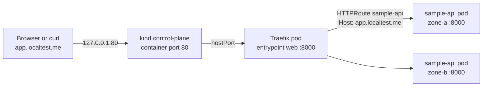
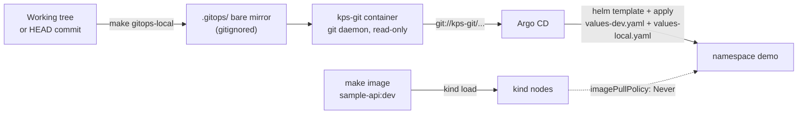
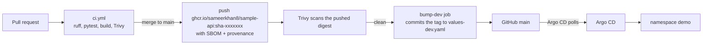
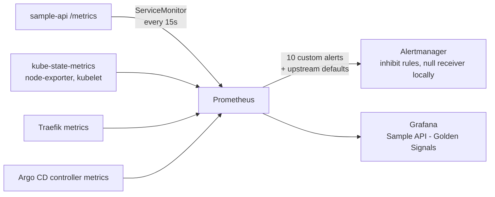

# Architecture

This page explains how the pieces fit together: what runs where, how a request reaches the
app, how a change gets deployed, how monitoring works, and which security controls are in place.
The design decisions behind it are in [docs/decisions/](decisions/README.md).

## Components and namespaces

Everything runs on one laptop in a [kind](https://kind.sigs.k8s.io/) cluster called `kps`.
Pinned versions live in [`versions.env`](../versions.env).

| Namespace | Component | Installed by | Version | What it does |
|---|---|---|---|---|
| `kube-system` | metrics-server | Helm chart 3.14.0 | 0.9.0 | CPU and memory usage for the HPA and `kubectl top` |
| `traefik` | Traefik | Helm chart 41.6.1 | v3.7.13 | Gateway API controller. Owns GatewayClass `traefik` and Gateway `traefik-gateway` |
| `monitoring` | kube-prometheus-stack | Helm chart 92.0.0 | Prometheus v3.15.0, Alertmanager v0.34.1, Grafana 13.2.3 | Metrics, alerts, dashboards, kube-state-metrics, node-exporter |
| `argocd` | Argo CD | Helm chart 10.9.6 | v3.5.3 | Pulls the app chart from Git and keeps the cluster in sync |
| `demo` | sample-api | Argo CD (chart `charts/sample-api`) | 0.1.0 | The example service |
| (Docker) | `kps-git` | `make gitops-local` | Alpine 3.24 + git daemon | Serves this repo to Argo CD over `git://` before it is pushed anywhere |

Cluster-wide: Gateway API CRDs v1.6.1 (standard channel), Kubernetes v1.36.4.

### Nodes

| Node | Labels | Runs |
|---|---|---|
| `kps-control-plane` | `ingress-ready=true` | Kubernetes control plane, CoreDNS, Traefik (hostPort 80/443), and the monitoring core: Prometheus, Alertmanager and kube-state-metrics |
| `kps-worker` | `topology.kubernetes.io/zone=zone-a` | Platform pods (Grafana, Argo CD, ...) and app pods |
| `kps-worker2` | `topology.kubernetes.io/zone=zone-b` | Platform pods and app pods |

The control plane keeps its `NoSchedule` taint, so app pods only land on the two workers.
Only Traefik and the monitoring core tolerate it. Keeping the monitoring core there means the
"worker node down" drill ([PlatformNodeNotReady](runbooks/PlatformNodeNotReady.md)) cannot take
the monitoring down with it. (Production: a dedicated node pool and more than one replica.)
The two simulated zones (node labels, not real zones) give `topologySpreadConstraints`
something to spread over: with 2 replicas, one pod runs in each zone.

## Request flow

1. `*.localtest.me` is public DNS that points to `127.0.0.1`.
2. kind maps `127.0.0.1:80` on the laptop to port 80 of the control-plane container
   (`listenAddress: 127.0.0.1`, so nothing is exposed to the LAN).
3. Traefik listens there through a `hostPort` and matches the `Host` header against the
   `HTTPRoute` objects attached to `traefik-gateway`.
4. Traefik sends the request straight to a ready pod IP on port 8000 (it reads the
   EndpointSlices, it does not go through the Service IP).
5. The NetworkPolicy in `demo` allows this, because it allows traffic from namespace `traefik`
   on the app port. Traffic from any other namespace is dropped. `make policy-test` checks it:
   a pod in `default` times out when it calls the Service.

The same Gateway serves Grafana, Prometheus, Alertmanager and Argo CD on their own host names.
In-cluster load Jobs (`make load`, `make rollout-test`, `make alert-demo`) call
`http://traefik.traefik.svc.cluster.local` with the header `Host: app.localtest.me`, so they
test the same path as a browser.

There is no HTTPS listener locally. Port 443 is mapped but nothing serves it yet (if 443 is
busy on the laptop, `make up` maps 8443 instead). A real cluster would add cert-manager and an
HTTPS listener on the Gateway.

## Deploy flow

### Local mode (default, works offline and before the repo is pushed)

- `make image` builds `sample-api:dev` and loads it into the nodes. No registry is needed.
- `make gitops-local` publishes the repo into a bare mirror, starts the `kps-git` container on
  the `kind` Docker network, and points the Argo CD application at it.
- If the folder is a git repo with commits, it publishes `HEAD` (commit mode). Otherwise it
  writes a throwaway snapshot commit that lives only in `.gitops/` (snapshot mode).
- Argo CD renders `charts/sample-api` with release name `sample-api` and syncs it with
  `prune` and `selfHeal`. Manual changes made with `kubectl` are undone.

### GitHub mode (after the repo is pushed)

- `make gitops REPO_URL=https://github.com/Sameerkhan8/kubernetes-platform-starter.git`
  points the same application at GitHub.
- `IMAGE_SOURCE=ghcr` drops `values-local.yaml`, so the cluster pulls the image tag that CI
  wrote into `values-dev.yaml`. The GHCR package must be public, or the cluster needs an
  imagePullSecret.
- CI never talks to the cluster. It only builds, scans, pushes and changes one line in Git.
  The image that gets deployed is the exact digest that was scanned after the push.
- A git tag `v1.2.3` gives the image that `main` built for that commit the release tag
  `1.2.3` (build once, promote the same image). Production would get its own application
  with `values-prod.yaml`, promoted by a pull request that changes that tag.

This GitHub path has not run yet: it starts working once the repo is pushed.

## Observability flow

- **Discovery.** Prometheus selects every ServiceMonitor and PrometheusRule in every namespace
  (`*SelectorNilUsesHelmValues: false`), so the app chart does not need a `release:` label.
- **App metrics.** `http_requests_total{method,path,status}`, `http_request_duration_seconds`
  (histogram), `http_requests_in_progress` and `sample_api_build_info`. The `path` label is the
  route template, and unknown paths become `unmatched`, so the number of series stays bounded.
  Probe and metrics endpoints are not counted.
- **Alerts.** Six app alerts ship inside the Helm chart (`charts/sample-api/rules/`), four
  platform alerts live in `monitoring/rules/`. Each has a `runbook_url` that points to
  [docs/runbooks/](runbooks/README.md), and promtool unit tests in `monitoring/tests/`.
  Three upstream default alerts are switched off because a custom alert covers the same thing
  cluster-wide (crash loops in any namespace, node not ready, node memory). Two more
  (`KubeHpaMaxedOut`, `KubeDeploymentReplicasMismatch`) stay on for every other workload;
  for sample-api, Alertmanager inhibit rules hide them while the matching SampleApi* alert
  fires, so one problem notifies once. Nothing loses coverage.
- **Dashboard.** The chart ships `dashboards/sample-api.json` as a ConfigMap with the label
  `grafana_dashboard: "1"`. The Grafana sidecar loads it from any namespace.
- **Notifications.** Locally, Alertmanager routes to a null receiver. A real setup routes
  critical alerts to a pager and warnings to a chat channel. `Watchdog` always fires on purpose.

## Security controls

| Area | Control |
|---|---|
| Laptop safety | Every Makefile target and script uses the repo-local `.kube/config`, passes `--context kind-kps`, and aborts unless the context is `kind-kps` with a local API server (`scripts/guard-context.sh`). |
| Pods | Pod Security `restricted` is enforced on `demo`. Non-root uid 10001, read-only root filesystem, all capabilities dropped, no privilege escalation, seccomp `RuntimeDefault`, no service account token mounted. |
| Network | Default-deny ingress and default-deny egress (DNS allowed) in `demo`. Only `traefik` and `monitoring` may reach the app port; load-test Jobs may call only the gateway. The gateway listens on `127.0.0.1` only. `make policy-test` proves it with throwaway pods. |
| Image | Multi-stage build, pinned base image digest, fully pinned Python dependencies, no pip in the runtime image. Trivy fails CI on fixable HIGH/CRITICAL findings, before and after the push (the pushed digest is scanned). |
| Supply chain | Every GitHub Action pinned to a commit SHA. Dependabot for actions, pip, Docker and Terraform. SBOM and provenance attached to the pushed image. |
| CI permissions | `permissions: {}` at the top of every workflow; each job asks only for what it needs. Pushes to GHCR use the short-lived `GITHUB_TOKEN`. |
| Cloud access | Terraform sets up GitHub OIDC with Workload Identity Federation, limited to this repository by name and numeric IDs. No JSON keys. The image-push identity works only for jobs on `main`; the read-only plan identity only for jobs in the reviewed GitHub Environment `tf-plan`. |
| Secrets | No secrets in Git. Grafana's admin password is random and lives only in a Kubernetes Secret. `make creds` prints it to the terminal only. |
| GitOps | The committed Argo CD project allows one repo (this one on GitHub), one namespace (`demo`), and only `Namespace` as a cluster-wide kind. Local mode adds exactly one more URL, the local git daemon, at apply time. |
| App endpoints | The demo-only endpoints (`/work`, `/error`, API docs) are switched off in the prod profile, and its public route sends only `/` to the app, so `/metrics` is never public. |

Not covered locally (listed in the README under "What I would add in production"):
TLS, an external secrets store, admission policies and image signing.

## Resource budget

Requests and limits are set for every component. Memory limits are always set.
CPU limits are set only on the app and the load Jobs (so the laptop demo stays predictable).

| Component | Replicas | CPU / memory request | Memory limit |
|---|---|---|---|
| Traefik | 1 | 50m / 64Mi | 256Mi |
| metrics-server | 1 | 20m / 48Mi | 128Mi |
| Prometheus Operator | 1 | 20m / 64Mi | 192Mi |
| Prometheus | 1 | 100m / 512Mi | 1Gi |
| Alertmanager | 1 | 10m / 32Mi | 96Mi |
| Grafana (main container) | 1 | 50m / 160Mi | 384Mi |
| kube-state-metrics | 1 | 10m / 48Mi | 128Mi |
| node-exporter | 3 (one per node) | 10m / 24Mi | 64Mi |
| Argo CD application controller | 1 | 50m / 192Mi | 512Mi |
| Argo CD repo server | 1 | 20m / 96Mi | 256Mi |
| Argo CD server | 1 | 20m / 64Mi | 192Mi |
| Argo CD Redis | 1 | 10m / 32Mi | 96Mi |
| Argo CD ApplicationSet controller | 1 | 10m / 48Mi | 128Mi |
| sample-api | 2 to 6 (HPA) | 50m / 64Mi | 128Mi (CPU limit 500m) |

### Measured memory

Measured with `docker stats --no-stream kps-control-plane kps-worker kps-worker2` on
2026-10-07, on a Linux laptop with 20 CPUs and 32 GB RAM (Docker 29.1.3, kind v0.33.0).
The numbers include Kubernetes itself (API server, etcd, kubelets), not only the pods.

| Moment | kps-control-plane | kps-worker | kps-worker2 | Total |
|---|---|---|---|---|
| Idle, 10 minutes after a clean `make up` (2 app pods) | 1.59 GiB | 1.30 GiB | 0.84 GiB | about 3.7 GiB |
| During `make load` (6 app pods, about 75s into the load; earlier cluster run) | 1.66 GiB | 0.90 GiB | 1.18 GiB | about 3.7 GiB |

The `kps-git` container uses about 2 MiB.

Idle and loaded totals are almost the same. The extra app pods are small (about 40 MiB each
at idle, from `kubectl top`), and most of the memory belongs to Kubernetes itself, Prometheus,
Grafana and Argo CD. Prometheus grows slowly while it collects data (24h retention, 1 GB size
limit), so later readings can be a little higher.
