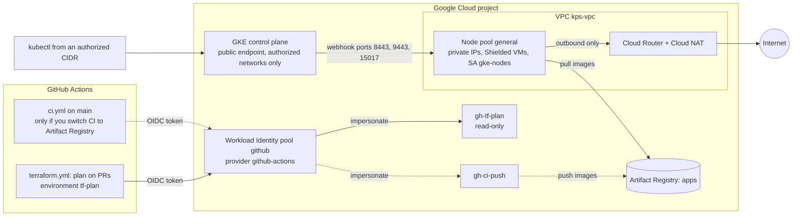

# terraform/gcp-gke: private GKE cluster on Google Cloud

This Terraform module builds a production-style Google Kubernetes Engine (GKE) setup
for the `sample-api` service in this repository: a private GKE Standard cluster, its
network, a Docker registry, and keyless access for GitHub Actions.

> **Status:** This module is validated (fmt/validate/tflint) but was not applied as part
> of this project. It also has offline unit tests (`terraform test` with a mocked
> provider). Nothing in this repository has created real Google Cloud resources.

It uses only plain `google` provider resources (no community modules), so every line
can be read and explained.

## What it builds

| File | Resources | Notes |
|---|---|---|
| `main.tf` | Project APIs | container, compute, artifactregistry, iam, iamcredentials, sts, cloudresourcemanager |
| `network.tf` | VPC, subnet with `pods` and `services` secondary ranges and VPC Flow Logs, Cloud Router, Cloud NAT, one firewall rule | Nodes have private IPs only |
| `gke.tf` | GKE Standard cluster + node pool `general` | Zonal by default, regional with `regional = true` |
| `iam.tf` | Node service account `gke-nodes` | Least privilege instead of the default Compute Engine account |
| `artifact-registry.tf` | Docker repository `apps` | Immutable tags, cleanup policies in dry-run |
| `workload-identity.tf` | Workload Identity pool `github`, OIDC provider `github-actions`, service accounts `gh-ci-push` and `gh-tf-plan` | GitHub Actions login without JSON keys |



## Security choices and why

| Choice | Why |
|---|---|
| Private nodes (`enable_private_nodes = true`) | Node VMs have no public IP, so they cannot be reached from the internet. |
| Cloud NAT for egress | Private nodes can still pull public images and call external APIs. Nothing can connect in. |
| Private Google Access on the subnet | Nodes reach Google APIs (Artifact Registry, Logging) without a public IP. |
| Authorized networks always on | The API server's public endpoint only accepts the CIDRs in `master_authorized_networks`. An empty list blocks all outside networks. |
| Dedicated node service account `gke-nodes` | The default Compute Engine service account often has the Editor role on the whole project. `gke-nodes` only has `roles/container.defaultNodeServiceAccount` and read access to one registry repository. |
| Workload Identity + `GKE_METADATA` | Pods get their own Google identity through a Kubernetes service account. They cannot read the node's credentials, and no key files are mounted. |
| Shielded nodes, Secure Boot, integrity monitoring | Protects node VMs against boot-level tampering. |
| Dataplane V2 (`ADVANCED_DATAPATH`) | Enforces Kubernetes NetworkPolicy, so the chart's default-deny policies work on GKE the same way as on the local kind cluster. |
| Release channel + weekend maintenance window | GKE keeps the cluster patched automatically, but only during a known window. |
| Surge upgrades (`max_surge = 1`, `max_unavailable = 0`) | A new node is ready before an old one is drained, so capacity never drops during an upgrade. |
| Immutable image tags | A tag such as `sha-abc1234` always means the same image. What runs is what was scanned. |
| Workload Identity Federation for GitHub Actions | CI gets short-lived tokens. There are no long-lived JSON keys to leak or rotate. The provider only accepts tokens from `var.github_repository`, checked by name and by the numeric repository and owner IDs (which never change). |
| Two CI identities, each tied to one trigger | `gh-ci-push` can only write to one registry repository, and only a job on the `main` branch can use it. `gh-tf-plan` can only read, and only a job in the GitHub Environment `tf-plan` (with required reviewers) can use it. Pull requests cannot use either one without a review. |
| `gh-tf-plan` has the basic `roles/viewer` role | A deliberate trade-off. Plan must read every resource type in the module, and a hand-picked list of viewer roles breaks each time one is added. It is still read-only. |
| VPC Flow Logs on the node subnet | A record of network connections for investigations. 10% sampling by default to keep the logging cost down (`flow_logs_sampling`). |
| Firewall rule for webhook ports | GKE's automatic rules let the control plane reach nodes only on ports 443 and 10250. Admission webhooks on other ports (8443, 9443, 15017) time out and block deploys. This is a common private-GKE problem. |
| `deletion_protection = true` | A stray `terraform destroy` cannot delete the cluster. |

## Requirements

- Terraform `>= 1.9.0, < 2.0.0` (checked with 1.9.8 and 1.16.5). CI uses the version in `versions.env`.
- Google provider `~> 8.6` (the lock file pins 8.6.0 with hashes for Linux, macOS and Windows).
- `gcloud` CLI with the `gke-gcloud-auth-plugin` component, for `kubectl` access.
- A Google Cloud project with billing enabled, and an account that can create the resources
  above (for a first apply this is usually a project Owner).

## Bootstrap order

Terraform state is stored in a GCS bucket. The bucket must exist before `terraform init`,
so it is created once by hand and is not managed by this module.

```bash
cd terraform/gcp-gke

PROJECT_ID=my-gcp-project-id            # placeholder: use your own project
STATE_BUCKET="${PROJECT_ID}-tfstate"

# 1. Log in. Application Default Credentials are what Terraform uses locally.
gcloud auth login
gcloud auth application-default login

# 2. Create the state bucket (private, versioned, uniform access).
gcloud storage buckets create "gs://${STATE_BUCKET}" \
  --project="${PROJECT_ID}" --location=us-central1 \
  --uniform-bucket-level-access --public-access-prevention
gcloud storage buckets update "gs://${STATE_BUCKET}" --versioning

# 3. Set your inputs (terraform.tfvars is gitignored).
cp terraform.tfvars.example terraform.tfvars
#    edit project_id, master_authorized_networks (your IP as /32), tf_state_bucket,
#    github_repository_id and github_owner_id

# 4. Initialise with the remote state bucket.
terraform init -backend-config="bucket=${STATE_BUCKET}" -backend-config="prefix=gcp-gke"

# 5. Review, then apply the saved plan. Plan files can hold secrets: never commit them.
terraform plan -out=gcp-gke.tfplan
terraform apply gcp-gke.tfplan
```

If the first plan says the Service Usage or Cloud Resource Manager API is disabled, enable
them once with `gcloud services enable serviceusage.googleapis.com cloudresourcemanager.googleapis.com --project="${PROJECT_ID}"`.
Terraform uses them to switch on the other APIs and to manage project IAM.

### Connect with kubectl (safely)

`get-credentials` adds the cluster to your kubeconfig and makes it the current context.
If your default kubeconfig already holds other clusters, write this one to its own file:

```bash
export KUBECONFIG="$HOME/.kube/kps-gke.yaml"
$(terraform output -raw get_credentials_command)
kubectl config get-contexts       # the new one is gke_<project>_<location>_<cluster>
kubectl --context gke_my-gcp-project-id_us-central1-a_kps-gke get nodes
```

Write the context name out in full (as above) in commands and scripts, so a command never
runs against whichever cluster happens to be current.

Your IP must be in `master_authorized_networks`, otherwise `kubectl` times out.

## Wire GitHub Actions (terraform.yml plan job)

The `plan` job in `.github/workflows/terraform.yml` is skipped until these repository
variables exist (Settings -> Secrets and variables -> Actions -> Variables). They are
not secrets: they are names, not credentials.

The job runs in the GitHub Environment `tf-plan`. Create it (Settings -> Environments) and
add yourself as a required reviewer: then no pull request can run Terraform with the plan
identity until someone has read the change. Only jobs in that environment can use
`gh-tf-plan` (see `workload-identity.tf`). Environment protection rules are free for public
repositories; private repositories need a paid GitHub plan for them.

The job writes only a summary to the run (how many resources would be created, changed or
deleted, and their addresses), never the full plan. Plan output can show project IDs, IAM
members and CIDRs, and the run logs of a public repository are public.

| GitHub variable | Value |
|---|---|
| `GCP_WORKLOAD_IDENTITY_PROVIDER` | `terraform output -raw workload_identity_provider` |
| `GCP_TF_PLAN_SERVICE_ACCOUNT` | `terraform output -raw tf_plan_service_account_email` |
| `GCP_PROJECT_ID` | your project ID |
| `TF_STATE_BUCKET` | the state bucket name (also set `tf_state_bucket` to it in `terraform.tfvars`) |

With the GitHub CLI, from this directory:

```bash
gh variable set GCP_WORKLOAD_IDENTITY_PROVIDER --body "$(terraform output -raw workload_identity_provider)"
gh variable set GCP_TF_PLAN_SERVICE_ACCOUNT    --body "$(terraform output -raw tf_plan_service_account_email)"
gh variable set GCP_PROJECT_ID                 --body "${PROJECT_ID}"
gh variable set TF_STATE_BUCKET                --body "${STATE_BUCKET}"
```

Notes:

- The plan runs with `-lock=false` because `gh-tf-plan` can read the state bucket but not write a lock file.
- `github_repository_id` and `github_owner_id` are filled in by the job from the GitHub
  context (`github.repository_id`, `github.repository_owner_id`); nothing to configure.
- The plan job gets its inputs from GitHub variables, not from your local `terraform.tfvars`.
  If you changed other inputs locally (for example `master_authorized_networks`), pass the
  same values to the job (for example as `TF_VAR_<name>` environment variables). Otherwise
  every pull request plan shows a change.
- If a plan fails with a permission error on one resource type, grant `gh-tf-plan` the
  matching viewer role. It should never get an admin or editor role.
- The repository's CI pushes images to GHCR today. To push to Artifact Registry instead, add a
  `google-github-actions/auth` step with `service_account: <ci_push_service_account_email>`
  to the `publish` job (it runs only on `main`, which is what `gh-ci-push` accepts) and log
  Docker in to `<region>-docker.pkg.dev`. Also stop pushing the moving `main` tag
  (`type=raw,value=main` in `ci.yml`), or set `immutable_tags = false`: with immutable tags,
  Artifact Registry rejects every push of an existing tag after the first one.

## Inputs

| Name | Type | Default | Description |
|---|---|---|---|
| `project_id` | string | (required) | Google Cloud project ID. |
| `region` | string | `us-central1` | Region for the subnet, NAT, registry and a regional cluster. |
| `zone` | string | `us-central1-a` | Zone for a zonal cluster. Must be in `region`. |
| `regional` | bool | `false` | `true` = control plane and nodes in 3 zones; `false` = one zone (cheaper). |
| `cluster_name` | string | `kps-gke` | Cluster name and prefix for network resource names (2-20 characters). |
| `network_name` | string | `kps-vpc` | VPC name. |
| `subnet_cidr` | string | `10.10.0.0/20` | Node IP range. |
| `pods_cidr` | string | `10.20.0.0/14` | Pod IP range (secondary range `pods`). |
| `services_cidr` | string | `10.24.0.0/20` | Service IP range (secondary range `services`). |
| `master_ipv4_cidr` | string | `172.16.0.0/28` | Control plane range. Must be a /28 that overlaps nothing else. |
| `master_authorized_networks` | list(object) | `[]` | `{cidr_block, display_name}` entries allowed to reach the API server. |
| `release_channel` | string | `REGULAR` | `RAPID`, `REGULAR` or `STABLE`. |
| `machine_type` | string | `e2-standard-4` | Node machine type. |
| `disk_size_gb` | number | `50` | Boot disk per node (minimum 10). |
| `min_nodes` | number | `1` | Minimum nodes, counted across all zones. |
| `max_nodes` | number | `3` | Maximum nodes, counted across all zones. |
| `spot` | bool | `false` | Use Spot VMs (cheaper, can be stopped at any time). |
| `deletion_protection` | bool | `true` | Block `terraform destroy` of the cluster. |
| `artifact_registry_repo` | string | `apps` | Docker repository ID. |
| `immutable_tags` | bool | `true` | Make image tags immutable. |
| `cleanup_dry_run` | bool | `true` | Cleanup policies only log, never delete. |
| `github_repository` | string | `Sameerkhan8/kubernetes-platform-starter` | `owner/name` allowed to use the CI identities. |
| `github_repository_id` | string | (required) | Numeric repository ID: `gh api repos/OWNER/REPO --jq .id`. |
| `github_owner_id` | string | (required) | Numeric owner ID: `gh api users/OWNER --jq .id`. |
| `tf_plan_environment` | string | `tf-plan` | GitHub Environment whose jobs may use `gh-tf-plan`. |
| `subnet_flow_logs` | bool | `true` | VPC Flow Logs on the node subnet. |
| `flow_logs_sampling` | number | `0.1` | Share of flows recorded (0-1]. |
| `tf_state_bucket` | string | `""` | State bucket; when set, `gh-tf-plan` gets read access to it. |
| `labels` | map(string) | `{project = "kubernetes-platform-starter", managed-by = "terraform"}` | Labels on every resource that supports them. A `cluster` label is added. |

## Outputs

| Name | Description |
|---|---|
| `cluster_name` | Name of the GKE cluster. |
| `cluster_location` | Zone or region of the cluster. |
| `cluster_endpoint` | Public IP of the API server (sensitive). |
| `get_credentials_command` | `gcloud container clusters get-credentials ...` for this cluster. |
| `network_name` | VPC name. |
| `subnet_name` | Node subnet name. |
| `artifact_registry_url` | Image prefix, `<region>-docker.pkg.dev/<project>/<repo>`. |
| `node_service_account_email` | Node service account. |
| `ci_push_service_account_email` | Service account GitHub Actions uses to push images. |
| `tf_plan_service_account_email` | Read-only service account for `terraform plan` in GitHub Actions. |
| `workload_identity_provider` | Full resource name of the GitHub OIDC provider (for `GCP_WORKLOAD_IDENTITY_PROVIDER`). |

## Artifact Registry cleanup: read before you turn it on

The repository has two cleanup policies:

- delete images with no tag that are older than 30 days;
- always keep the 20 most recent versions (in Artifact Registry, KEEP wins over DELETE).

They start in **dry-run** (`cleanup_dry_run = true`): Artifact Registry only logs what it
would delete.

Warning: a cleanup policy can delete an image that is still running in the cluster. Nothing
breaks at first, because the node has already pulled it. The next time a node has to pull it
again (a new node, a rescheduled pod, or `imagePullPolicy: Always`), the pull fails with
`ImagePullBackOff`. To avoid this:

- deploy tagged images (`sha-<commit>` or a version number) and keep those tags;
- do not add a policy that deletes tagged images without checking what is deployed;
- leave the policies in dry-run first, read the logs, and compare them with the images that run
  before you set `cleanup_dry_run = false`:
  `kubectl --context <your-gke-context> get pods -A -o jsonpath='{..image}'`

Multi-architecture images and build attestations (SBOM, provenance) are stored as extra
manifests next to the tagged image. Check in the dry-run logs how they are treated before
enabling deletion.

## Cost

This module creates resources that are billed by Google Cloud. The main ones are the node
VMs and their disks, Cloud NAT, the GKE cluster management fee, Artifact Registry storage
and network egress. No prices are given here because they change and depend on region
and usage. Use the [Google Cloud pricing calculator](https://cloud.google.com/products/calculator)
with your own region, machine type and node count.

The GKE free tier covers the cluster management fee of one zonal cluster per billing
account (check current pricing). This is why `regional = false` is the default. Spot VMs
(`spot = true`) lower node cost for dev and demo use.

## Destroy

```bash
# 1. Allow the cluster to be deleted.
terraform apply -var deletion_protection=false     # or set it in terraform.tfvars
# 2. Delete everything this module created.
terraform destroy
```

The state bucket is not managed here; delete it by hand if you no longer need it.
A deleted Workload Identity pool or provider keeps its ID reserved for 30 days. To re-create
the module within that time, change `wif_pool_id` / `wif_provider_id` in `main.tf` or
undelete the old pool.

## How this module was checked

All offline. No `plan` or `apply` was run against a real Google Cloud project.

```bash
terraform fmt -check -recursive ..                 # formatting
terraform init -backend=false -input=false         # no state bucket needed
terraform validate                                 # with Terraform 1.9.8 and 1.16.5
tflint --init && tflint                            # google ruleset 0.40.0, see .tflint.hcl
terraform test                                     # tests/gcp-gke.tftest.hcl, mocked provider
```

The tests in `tests/gcp-gke.tftest.hcl` plan the module against a mocked `google` provider
(no credentials, no API calls) and check, for example, that nodes are private, that the
OIDC provider only trusts this repository (by name and numeric IDs), that flow logs are on
by default, that a zonal or regional location is chosen correctly, and that bad inputs (zone
outside the region, `min_nodes > max_nodes`, a control plane range that is not a /28, a
non-numeric repository ID) are rejected.

## What I would add for a real production setup

- **DNS-based control plane endpoint** (`control_plane_endpoints_config`): API access is
  controlled by IAM instead of IP allow-lists.
- **One project per environment** (dev, staging, prod), each with its own state prefix.
  This module assumes one cluster per project: the service account IDs are fixed.
- **Binary Authorization** to admit only signed images.
- **Customer-managed encryption keys** for Kubernetes Secrets (`database_encryption`).
- **Maintenance exclusions** around important release dates.
